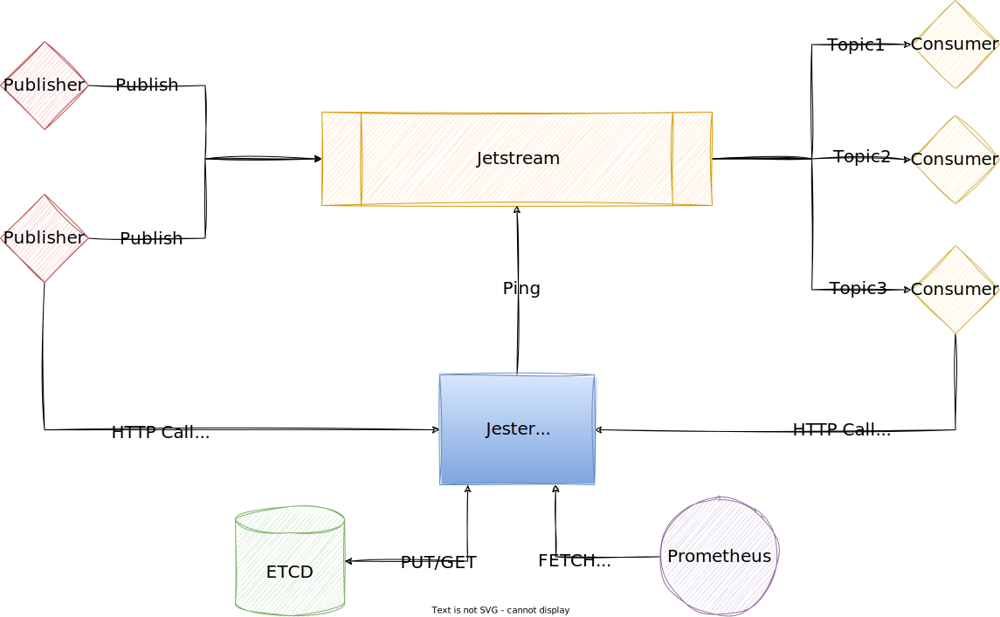

# Jester

__JetStream__ tester using Golang. This is an open-source tool for testing
a NATS JetStream cluster. __Jester__ is a combination of three components, Agent
Publisher, and Consumer. Agent is the brain behind Jester. What it does is to
control publishers, consumers, and the NATS cluster. It monitors events that are
being sent to cluster to give us a blackbox.

## How it works?

Jester agent is the core component. Every other component sends its events to the agent
via HTTP call over an endpoint named ```/cover```. Agent uses an __ETCD__ storage in order
to keep track of these events. Finally, it exposes them as prometheus metrics over ```/metrics```
endpoint.



## Setup

If you want to test __Jester__, change the config files in ```config``` dir. The example config file
is based on ```docker-compose.yml``` settings. Make sure to update the services names if you changed
anything.

Start the example case:

```shell
docker-compose up -d
```

### example.config

```yaml
etcd:
  endpoints:
    - "etcd:2379"
  timeout: 5 # seconds
http:
  agent: "http://agent:8080" # address of the jester agenet
  port: 8080
nats:
  host: "nats://jetstream:4222"
  topic: "snappcloud.io.EVENTS"
  max_retry: 10 # times
metrics:
  enable: true
  subsystem: "jester"
  namespace: "default"
publisher_interval: 5 # seconds
```
