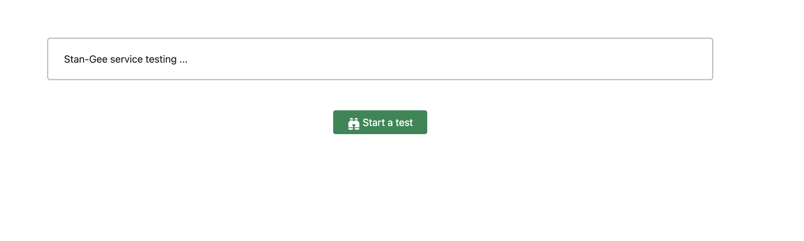

# Stan-Gee Client
A simple client for testing our stan-gee health and status.


## What does this client do?
This client makes a connection to our Stan-Gee gRPC service
and then provides a testing environment, so you can check the service.



## Deployment
To deploy this project on virtual machine using docker and nginx, use the following commands.<br />
First clone into the client directory, so you have the following directories:
```shell
|_ backend/
|_ frontend/
|_ nginx/
|_ docker-compose.yml
```

Then use the following command to make the deployment:
```shell
docekr-compose up -d
```

To terminate it, use the following command:
```shell
docker-compose down
```